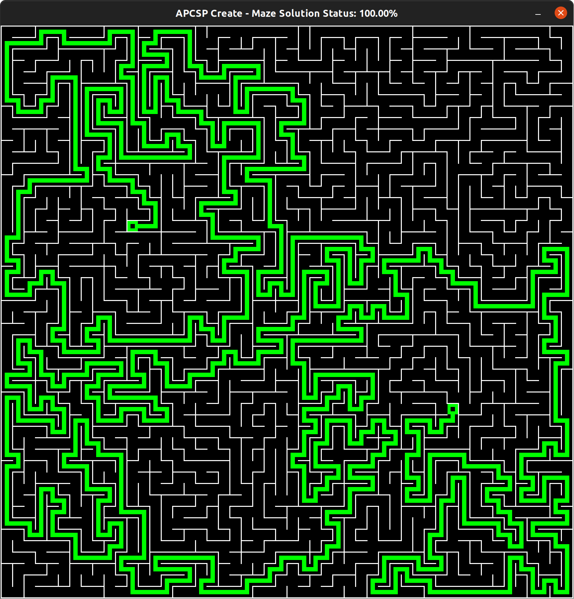

# Scalable Maze Generator and Fake Solver
Scalable Maze Generator and Fake Solver written in Python3 using Pygame, NumPy, and Screeninfo

The maze is generated through a depth-first search (DFS) with backtracking. The fake solver employs a stack to store the generation moves from the selected start point to end point.

There is support for variable display size and resolutions, custom grid size and colors, and a fake solve.

This was also part of my submission for the AP Computer Science Principles test.

